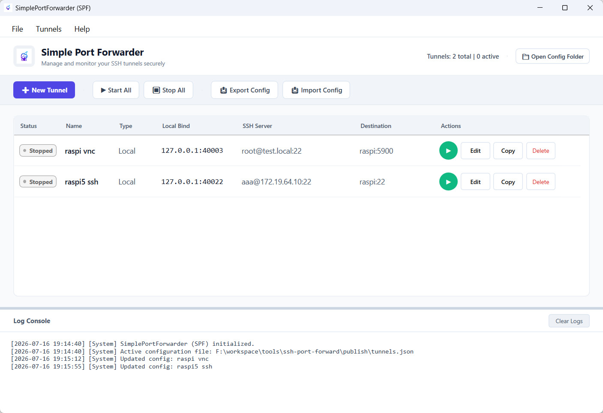

# 极简端口转发工具 (Simple Port Forwarder - SPF)

[English](README.md) | [简体中文](README_zh.md) | [日本語](README_ja.md)

SPF 是一个轻量、便携的 Windows 实用工具，用于管理和运行 SSH 端口转发隧道（支持本地、远程和动态转发模式）。



## 功能特点

- **端口转发模式**：支持本地端口转发 (`-L`)、远程端口转发 (`-R`) 以及动态转发 (`-D` SOCKS5 代理) 模式。
- **安全性**：SSH 登录密码仅在运行时手动输入，永远不会保存到本地的配置文件中。
- **端口冲突检测**：在启动隧道前自动检测本地端口是否已被占用，防止冲突报错。
- **自动断线重连**：连接断开时自动触发指数退避重试，恢复网络后自动重新建立连接。
- **日志控制台**：直观展示实时连接状态、详细数据流向以及错误信息。
- **配置管理**：支持一键导入/导出配置文件，并支持快速复制/克隆已有隧道。

## 使用说明

请从 **GitHub Releases** 页面下载预编译的可执行程序。

如果您选择从源码编译，生成的目标可执行程序将会位于 `publish/` 目录下：
- `publish/SPF.exe` (轻量依赖版，需要您的系统安装有 .NET 8.0 Desktop Runtime)
- `publish/self_contained/SPF.exe` (独立完整版，已包含运行所需环境，无需安装任何额外依赖)

## 开发编译

本工具需要安装有 .NET 8.0 SDK 环境。使用以下命令即可编译：
```bash
dotnet build SPF.sln
```
